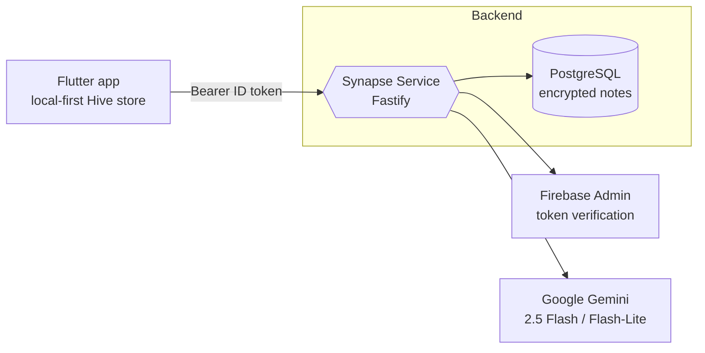

<div align="center">

# Synapse Service

**The backend for [Synapse](https://thesynapsetool.com) — a local-first knowledge graph for the things you read, watch, and think about.**

AI-powered connection discovery · encrypted cloud backup · graph sync

[](./LICENSE)
[](https://nodejs.org)
[](https://www.typescriptlang.org)
[](https://fastify.dev)

</div>

---

## Overview

Synapse is **local-first**: the Flutter client owns the source of truth in an on-device Hive store. This service is the thin, stateless backend that gives the app three things it can't do alone:

1. **Cloud backup & cross-device sync** — push/pull the entire knowledge graph (books, notes, links, layout).
2. **AI suggestions** — Gemini surfaces *non-obvious* semantic connections between notes ("hidden connections") and recommends new books/movies/series based on a user's library.
3. **Identity** — Firebase-authenticated, per-user data isolation.

Sensitive note content is **encrypted at rest** (AES-256-GCM) before it ever touches PostgreSQL, so a database dump alone reveals nothing readable.

## Architecture



Every request (except `/health`) is verified against Firebase before reaching a handler. The device remains authoritative — `push` mirrors the device state into normalized tables (and *deletes* rows no longer present on the device), while `pull` reconstructs the graph for a new device or restore.

## Tech stack

| Concern | Choice |
| --- | --- |
| Runtime | Node.js 20 |
| Language | TypeScript 5.3 (ESNext, strict) |
| HTTP framework | [Fastify 4](https://fastify.dev) (+ helmet, cors, rate-limit, sensible) |
| Database | PostgreSQL 16 (`@fastify/postgres`) |
| Auth | Firebase Admin SDK (ID-token verification) |
| AI | Google Gemini (`@google/generative-ai`) |
| Encryption | Node `crypto` — AES-256-GCM |
| Deployment | Docker (multi-stage, non-root) → Railway |

## API reference

All routes require a Firebase `Authorization: Bearer <ID_TOKEN>` header **except** `GET /health`. Email-unverified accounts are rejected.

### Health

| Method | Path | Description |
| --- | --- | --- |
| `GET` | `/health` | Liveness + dependency status (DB latency, Gemini/Firebase configured, memory). Returns `503` if the DB is unreachable. |

### Users — `/v1/users`

| Method | Path | Description |
| --- | --- | --- |
| `POST` | `/sync` | Upsert the authenticated user (called on first login). |
| `DELETE` | `/me` | Permanently delete the user: cascades all Postgres data **and** removes the Firebase Auth account (App Store compliance). |

### Sync — `/v1/sync`

| Method | Path | Description |
| --- | --- | --- |
| `POST` | `/push` | Upload the full graph (`books`, `notes`, `links`, `exported_at`). Single transaction; note `title`/`body`/`topic` encrypted before insert; device is source of truth. |
| `GET` | `/pull` | Download the latest graph (decrypted). Falls back to the legacy `snapshots` table if the user hasn't pushed since migration. |
| `POST` | `/layout` | Save force-directed node positions (batch upsert). |
| `GET` | `/layout` | Restore saved node positions. |

### AI — `/v1/ai`

| Method | Path | Description |
| --- | --- | --- |
| `POST` | `/suggest` | Send notes; Gemini **2.5 Flash** finds hidden semantic links with explanations. Limited to **3 generations/user/day**. |
| `POST` | `/discover` | Send a library item; Gemini **2.5 Flash-Lite** recommends a book/movie/series with a "Because:" rationale. Server-side cached. |

## Data model

```
users ─┬─< books ──< notes ──< note_links (source/target)
       │                 └──< graph_layout
       └─< ai_usage (per-user daily counters)
```

- IDs for `books` / `notes` / `note_links` are **client-generated UUIDs** (the device owns identity).
- `snapshots` is a legacy JSONB table kept only as a migration fallback.
- Full schema lives in [`db/schema.sql`](./db/schema.sql), including the idempotent one-time snapshot → normalized-tables migration.

## Security

- **Authentication** — Firebase ID token verified on every non-public request; unverified emails blocked.
- **Encryption at rest** — note `title`, `body`, and `topic` are AES-256-GCM encrypted with a per-call random IV and authentication tag. See [`src/lib/crypto.ts`](./src/lib/crypto.ts).  
  ⚠️ **`DB_ENCRYPTION_KEY` loss = permanent data loss.** Back it up; never rotate it after data is written.
- **Rate limiting** — 200 req/min globally (keyed by UID, falling back to IP); AI routes tightened to 20 req/min plus the per-user daily cap.
- **Hardening** — `helmet` security headers, CORS disabled (no browser client), sanitized error responses in production, runs as a non-root container user.

## Getting started

### Prerequisites

- Node.js 20+
- Docker (for local PostgreSQL)
- A Firebase project (service account) and a Google AI (Gemini) API key

### Setup

```bash
git clone https://github.com/<your-org>/synapse-service.git
cd synapse-service
npm install

cp .env.example .env          # then fill in the values (see below)

npm run setup:local           # starts Postgres in Docker + runs the schema migration
npm run dev                    # hot-reloading dev server on http://localhost:3000
```

Verify it's up:

```bash
curl http://localhost:3000/health
```

### Environment variables

| Variable | Required | Description |
| --- | --- | --- |
| `DATABASE_URL` | ✅ | PostgreSQL connection string (Railway injects this in prod). |
| `DB_ENCRYPTION_KEY` | ✅ | 64-char hex (32 bytes). Generate: `openssl rand -hex 32`. |
| `GEMINI_API_KEY` | ✅ | Google AI Studio API key. |
| `FIREBASE_PROJECT_ID` | ✅ | Firebase project ID. |
| `FIREBASE_CLIENT_EMAIL` | ✅ | Service-account email. |
| `FIREBASE_PRIVATE_KEY` | ✅ | Service-account private key (escaped `\n` newlines). |
| `PORT` / `HOST` | — | Default `3000` / `0.0.0.0`. |
| `NODE_ENV` / `LOG_LEVEL` | — | `production` raises the log floor to `info`. |

The server **fails fast at boot** if any required variable is missing or `DB_ENCRYPTION_KEY` isn't exactly 64 hex chars.

## Scripts

| Script | Purpose |
| --- | --- |
| `npm run dev` | Hot-reloading dev server (`tsx watch`). |
| `npm run build` | Compile TypeScript + copy prompt templates to `dist/`. |
| `npm start` | Run the compiled server (`dist/server.js`). |
| `npm test` | Run the Node test runner over `test/**/*.test.ts`. |
| `npm run test:watch` | Tests in watch mode. |
| `npm run test:local` | Smoke test against a running instance. |
| `npm run db:up` / `db:down` | Start / stop the local Postgres container. |
| `npm run db:migrate` | Apply `db/schema.sql` to the local DB. |
| `npm run setup:local` | One-shot local bootstrap (`db:up` + migrate). |

## Testing

```bash
npm test
```

Tests use Node's built-in test runner with a lightweight Postgres mock (`test/helpers/mock-pg.ts`) and fixtures — no live database required.

## Deployment

Production runs as a multi-stage Docker image on [Railway](https://railway.app):

- [`Dockerfile`](./Dockerfile) — builds, prunes dev deps, runs as a non-root `synapse` user.
- [`railway.toml`](./railway.toml) — Dockerfile builder, `/health` health check, restart-on-failure.
- CI deploys via GitHub Actions ([`.github/workflows/deploy.yml`](./.github/workflows/deploy.yml)) using a `RAILWAY_TOKEN` secret.

```bash
docker build -t synapse-service .
docker run -p 3000:3000 --env-file .env synapse-service
```

## Project structure

```
src/
  server.ts            # boot, env validation, graceful shutdown
  app.ts               # Fastify wiring: plugins, middleware, routes
  config/              # tunables (AI daily limits, …)
  lib/                 # crypto, prompt loading
  plugins/             # firebase auth hook, postgres
  prompts/             # Gemini prompt templates (markdown)
  routes/
    health.ts
    users.ts
    sync/              # push / pull / layout
    ai/                # suggest / discover (+ caching, JSON parsing)
db/schema.sql          # PostgreSQL schema + migration
test/                  # Node test runner specs + helpers
scripts/               # one-off migrations & smoke tests
```

## License

Licensed under the [Apache License 2.0](./LICENSE). Copyright © 2026 Ismael Hernandez. See [`NOTICE`](./NOTICE) for attribution and trademark terms — "Synapse" and "thesynapsetool.com" are reserved names.
